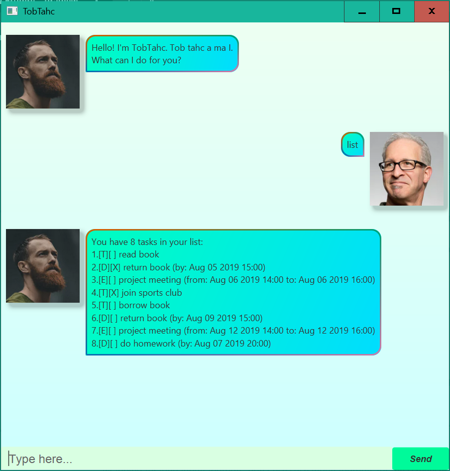

# TobTahc User Guide

TobTahc is a task management chatbot that helps you keep track of your todos, deadlines and events. With a simple command-line style interface and persistent storage, TobTahc makes task management effortless.



## Quickstart

1. Download the jar file from [here](https://github.com/coder114514/ip/releases/latest).
1. Run the following command within the enclosing folder of the JAR file.

   ```sh
   java -jar tobtahc.jar
   ```

1. Type commands in the text field and press Enter or click Send.
1. The `data` directory is for storing your tasks.

Program Options:

```
Usage: java -jar tobtahc.jar [options]

Options:
  -g, --gui, /gui      Start the application in GUI mode (default)
  -c, --cli, /cli      Start the application in CLI mode
  -h, --help, /?       Show this help message
```

## Features

### Adding a ToDo: `todo`

Add a simple task w/o any date or time.

**Format**: `todo <task description>`

**Example**: `todo read book`

---

### Adding a Deadline: `deadline`

Add a task with a due time.

**Format**: `deadline <task description> /by <due time in format y-M-d HH:mm>`

**Example**: `deadline return book /by 2019-8-5 15:00`

---

### Adding an Event: `event`

Add a task with both start and end times.

**Format**: `event <task description> /from <start time in format y-M-d HH:mm> /to <end time in format y-M-d HH:mm>`

**Example**: `event project meeting /from 2019-8-6 14:00 /to 2019-8-6 16:00`

---

### Listing All Tasks: `list`

Display all tasks in the task list.

**Format**: `list`

**Task Status Symbols**:

* `[T]` = ToDo, `[D]` = Deadline, `[E]` = Event
* `[X]` = Done, `[ ]` = Not Done

---

### Marking a Task as Done: `mark`

Mark a task as completed.

**Format**: `mark <task no.>`

**Example**: `mark 1`

---

### Marking a Task as Not Done: `unmark`

Mark a task as incomplete.

**Format**: `unmark <task no.>`

**Example**: `unmark 1`

---

### Deleting a Task: `delete`

Remove a task from the task list.

**Format**: `delete <task no.>`

**Example**: `delete 1`

---

### Finding Tasks: `find`

Search for tasks containing the keyword. The search is case-sensitive and matches any part of the task description.

**Format**: `find <keyword>`

**Example**: `find book`

---

### Clearing All Tasks: `clear`

Completely wipe the task list.

**Format**: `clear`

---

### Listing all Deadlines due before or on a certain date: `before or on`

List all Deadlines that are due before or on a certain date.

**Format**: `before or on <date in format yyyy-MM-dd>`

**Example**: `before or on 2019-08-06`

---

### Listing all Events occuring on a certain date: `occurs on`

List all Events that occur on a certain date.

**Format**: `occurs on <date in format yyyy-MM-dd>`

**Example**: `occurs on 2019-08-12`

---

### List all Tasks in a sorted way: `sort`

List all tasks in a sorted way:

1. All Deadlines that are not done, sorted by due time.
1. All Events that are not done, sorted by start time.
1. All ToDos that are not done.
1. All tasks that are done.

**Format**: `sort`

---

### Exiting the Application: `bye`

Exit TobTahc.

**Format**: `bye`

---

And TobTahc just echos anything that is not a command.

## Data Storage

TobTahc saves all your tasks in `data/tasks.txt`. You may take a look at `data/tasks-example.txt` for an example `tasks.txt`.

## Date and Time Format

As you can see in the previous section, some commands ask you to input a date time in format `y-M-d HH:mm`, while some commands ask you to input a date in format `yyyy-MM-dd`. And TobTahc is not very flexible on date time format, so if you see that TobTahc cannot understand your command, please check your date time format accordingly.

### Date

* `y`/`yyyy`: Year (`2019`).
* `M`: Month of the year (1-12 or 01-12).
* `d`: Day of the month (1-31 or 01-31).
* `MM`: Month of the year (01-12).
* `dd`: Day of the month (01-31).
* `-`: Literal separator.

### Time

* `HH`: Hour of the day (00-23).
* `mm`: Minute of the hour (00-59).
* `:`: Literal separator.
